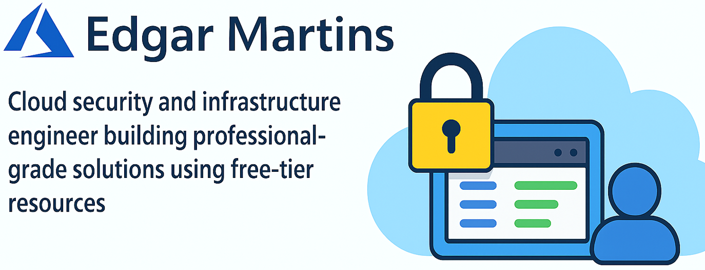

  

# 👋 Hi, I'm Edgar Martins

🔐 Cloud Security & Infrastructure Engineer  
💡 Passionate about building professional-grade solutions using free-tier resources  
🌍 Based in Brazil | 📦 Azure | ☁️ Cloud Governance | 🔐 IAM

---

## 🚀 Featured Project

### [Azure IAM Portal Project](https://github.com/edomartinss/azure-iam-portal)
> Role-Based Access Control, Azure AD Groups, and Free-Tier Governance  
> Built entirely using the Azure graphical portal — no CLI, no SDKs

📸 Includes screenshots, RBAC setup, and documentation  
🧠 Focused on cost-efficient cloud security architecture

---

## 🛠️ Technologies I Work With

- Microsoft Azure (IAM, RBAC, EntraID, Storage, Intune)
- Infrastructure as Code (Terraform)
- GitHub Actions & CI/CD
- Cloud Computing, CyberSecurity & Artificial Intelligence

---

## 📫 Let's Connect

- [LinkedIn](https://www.linkedin.com/in/edomartinss)
- [GitHub](https://github.com/edomartinss)
- Email: edgar.emartins@email.com*

---

> “Security is not a product, but a process.” – Bruce Schneier
